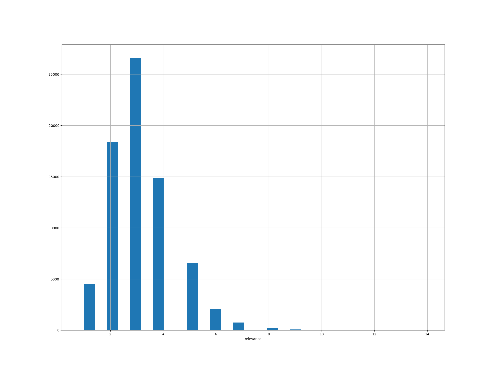

# Machine Learning Engineer Nanodegree
## Capstone Project
December 31st, 2019

## I. Definition

### Project Overview

I found this challenge from Kraggle. https://www.kaggle.com/c/home-depot-product-search-relevance

Customer can come to homedepot.com to find and buy the latest products and to get timely solutions
 to their home improvement needs. It is critical for HomeDepot not only to provide accurate product 
 information but also relevant results which best match customers’need.

Search relevancy is an implicit measure Home Depot uses to gauge how quickly they can get customers to the right products. Currently, human raters evaluate the impact of potential changes to their search algorithms, which is a slow and subjective process. By removing or minimizing human input in search relevance evaluation, Home Depot hopes to increase the number of iterations their team can perform on the current search algorithms.

Search relevance is a challenging problem to solve as part of search engine system for any ecommerce company. More importantly, search relevance plays critical important role to convert the view/browser of customer activity to generate final sale. Some of papers have more details on how search relevance works. 

For example, this one [amazon search](http://additivegroves.net/papers/a9ext_sigir16.pdf), presents few challenges on improve search relevance, including how to match product type and search queries and how to find specific vertical against query. Another one is here [eBay search](http://sigir-ecom.weebly.com/uploads/1/0/2/9/102947274/ebay_search_architecture.pdf), which talks about in details on how information retrieval technologies are applied to get to the best search relevance.

The relevance between search/product pair are evaluated by human raters. However, human rating
 is a slow and subjective process. There are almost infinite search/product pairs so it is impossible
  for human raters to give a relevance score to all possible search/product pairs. 

A better way is to build a model based on search/product pair and its relevance score and use it to predict the relevance

The core technologies in the domain of search relevance comes down to how to find the closeness in terms of simlarity between query and item textual info and the model needs to optimized to match and evaluated/tested by human raters's judgement. 


### Problem Statement

The data set contains a number of products and real customer search terms from Home Depot’s website.
 
To create the ground truth labels, Home Depot has crowd-sourced the search/product pairs to multiple human raters.

The relevance is a number between 1 (not relevant) to 3 (highly relevant). Each pair was evaluated by at least three human raters. The provided relevance scores are the average value of the ratings. The relevance score is between 1 (not relevant) to 3 (perfect match). A score of 2 represents partially or somewhat relevant.

The available raw data consists of 

- search_term
- product_title
- relevance


1. As the raw data are all text information, it can not be used to train the model. So the first step is to map text information, i.e search terms and product title to numbers. That’s called text vectorization in NLP world. A simple and effective model for thinking about text documents in machine learning is called the Bag-of-Words Model, or BoW. In brief, it throws away all of the order information in the words and focuses on the occurrence of words in a document. For example, how many terms of search query are found in product title. 

2. Pre-processing or transforming text into something an algorithm can digest it a complicated process. Before analyzing a text document, a consistence processing steps need to apply to both search query and product title. Tokenization, stop-words elimination and stemming are the most widely used pre-processing methods. With the context of this specific problem, some other procedures are also needed, for example, normalize units/size info, etc.

3. Now explore the features, understand the features, target variable and get some basic observations.

4. Train a baseline model using Linear Regression. Gauge the performance. Then train several other algorithms and gauge the performance.

5. Tune the ensemble model and use GridSearchCV to find best parameters for the models and do final evaluate and see if there are more ways to improve it. 


### Metrics

The quality of the model is evaluated using root mean squared error (RMSE), as it is suggested by original problem


The RMSE is the square root of the variance of the residuals. It indicates the absolute fit of the model to the data–how close the observed data points are to the model’s predicted values. As the square root of a variance, RMSE can be interpreted as the standard deviation of the unexplained variance. Lower values of RMSE indicate better fit. RMSE is a good measure of how accurately the model predicts the response, and it is the most important criterion for fit if the main purpose of the model is prediction. Besides, it is largely used for numerical predictions, which is what this problem fit.

[Choosing the Right Metric](https://medium.com/usf-msds/choosing-the-right-metric-for-machine-learning-models-part-1-a99d7d7414e4) implies RMSE is the default metric of many models for prediction because loss function defined in terms of RMSE is smoothly differentiable and makes it easier to perform mathematical operations.

In short, we will evaluate model on the root mean squared error, as it is a reasonable pick.


## II. Analysis

### Data Exploration

[code/step01-raw-data-analysis.py](code/step01-raw-data-analysis.py)


- Train dataset has total 74067 instances
  
  There are 5 columns in train set, named as 'id', 'product_uid', u'product_title', u'search_term', u'relevance'
  where `relevance` is relevance of pair search_term / product per human rater


- Checking into `search_term`, the size of search query

  ```
  COUNT(UNIQ(search_term) = 11795
  ```
  
  and len of tokens in each search term
  
  ```
    mean         3.159207
    std          1.262096
    min          1.000000
    25%          2.000000
    50%          3.000000
    75%          4.000000
    max         14.000000
   ```
   

- Chekcing into the `relevance`,

  ```
  count    74067.000000
  mean         2.381634
  std          0.533984
  min          1.000000
  25%          2.000000
  50%          2.330000
  75%          3.000000
  max          3.000000
  ```
 


  the search term mostly are short queries, as mean=2


### Exploratory Visualization

[code/step01-raw-data-analysis.py](code/step01-raw-data-analysis.py)


**distplot**


**counterplot** 


 
  The relevance is a number between 1 to 3. 
  
    -  1 (not relevant)
    -  2 (mildly relevant)
    -  3 (highly relevant). 
    
  Per the above diagram, the query and products are mostly relevance per countplot 

  There are more details to explore after feature pre-processing...

### Algorithms and Techniques

I will use various NLP techniques to generate new numeric features out of original text data.
Then I will train SKLearn regressors, optimized with grid search. 

Programing language - python and `Scikit-learn` toolkit


## Benchmark Model

- Use simple naive model as baseline model - `Linear Regression`
- Per [Kraggle leader board](https://www.kaggle.com/c/home-depot-product-search-relevance/leaderboard), 
the top one is `0.43192` of RMSE. I will upload my model to compare and hope to achieve good ranking


## III. Methodology

### Data Preprocessing

[code/step02-feature-engineering.py](code/step02-feature-engineering.py)

- **FUNC preprocessingTextFeatures**

  run uniform normalization process against three text fields

  `search_term`, `product_title`, `product_description`

  The process consists three basic steps, 
    - `Tokenization`
    - `standardize_units`
    - `PorterStemmer`

- **FUNC extractNumberFeatures**
  Feature extraction is the most important part and most challenge for this problem.
  
  I adopted the common/basic technique of NLP and information retrival
  
  - Counting features
    • len_query : length of the search term
    • len_title: length of the title of each product
    • len_desc: length of the description of each product
  
  - Common words in search terms and the text information about the product
    • query_feq_title: common words between search terms and title of the product
    • query_feq_desc: common words between search terms and description of the product
    
  - Statistical features  
    • term_ratio_title: term_feq_title / len_query
    • term_ratio_desc: term_feq_desc / len_query


### Numberic Feature Exploration

[code/step03-data-exploration.py](code/step03-data-exploration.py)

- corrmatrix

```
    relevance           1.000000
    term_ratio_title    0.352815
    term_ratio_desc     0.285134
    term_feq_title      0.215921
    query_feq_title     0.170965
    term_feq_desc       0.161321
    query_feq_desc      0.086555
    len_desc            0.040001
    len_title          -0.019840
    len_query          -0.073189
    product_uid        -0.130656
```
    
- pairplot


  Correlation coefficients are always values between -1 and 1, where -1 shows a perfect, linear negative correlation, and 1 shows a perfect, linear positive correlation
  
  per above plot, the relative highly positve corelated features are 
  - `term_ratio_title`
  - `term_ratio_desc`
  - `term_feq_title`
  - `query_feq_title`
  
  even though the corelation overall is not strong.
  
  On the other hand, `product_uid` shows negative corelated, which is a little surpise. It has to do with how product_uid is chosen internal to home depot
  
  
- relevance-vs-productid-pointplot


  This diagram implies some correlation between productid distribution and search relevance


### Implementation

#### Train baseline model 

[code/step02-feature-engineering.py](code/step04-train-model-baseline.py)

Rule of thumb, starts with `simple`. Beginning with the simple case, Single Variable Linear Regression is a technique used to model the relationship between a single input independent variable (feature variable) and an output dependent variable using a linear model i.e a line. Linear regression is simple to understand which can be very valuable for business decisions. 

Training sklearn's `linear_model.LinearRegression()` with all training data, it yields the following results

```
trainSet RMSE=0.488282
testSet  RMSE=0.488518
```
The result looks relatively good. But it seems that the model is too simple with bias generated. 


#### Train out-of-box models

Given the nature of this particular problem, the next model is chosen by me is DecisionTree Regression. 

for reasons
 - the output of a decision tree can be easily interpreted (by humans) as rules.
 - it will address non-linearity, compared with baseline model. Great at learning complex, highly non-linear relationships. They usually can achieve pretty high performance
 - simplicity, easy coding
 - fast computation for large dataset. 

Both [amazon search](http://additivegroves.net/papers/a9ext_sigir16.pdf), and [eBay search](http://sigir-ecom.weebly.com/uploads/1/0/2/9/102947274/ebay_search_architecture.pdf) employs DecisionTree as the basic layer model. 

Though, decision trees can be prone to major overfitting. To address overfitting then achieve optimal performance, ensemble techniques can be applied on top of decision tree model. In short, a set of weak learners or decision tree are combined to create a strong learner that obtains better performance than a single one.

Refer to [ensemble methods]https://becominghuman.ai/ensemble-learning-bagging-and-boosting-d20f38be9b1e, for more details


[code/step05-train-model-outofbox.py](code/step05-train-model-outofbox.py)


|Classifier|score - test|score - train|size|time - predict|time - train|
|----------|------------|-------------|----|--------------|-------------|
|LinearRegression|0.4888|0.4949|5000|0.0014|0.0030|
|LinearRegression|0.4888|0.4921|10000|0.0017|0.0015|
|LinearRegression|0.4885|0.4882|74067|0.0006|0.0040|
|DecisionTreeRegressor|0.6941|0.0115|5000|0.0047|0.0016|
|DecisionTreeRegressor|0.6822|0.0320|10000|0.0048|0.0025|
|DecisionTreeRegressor|0.6840|0.0667|74067|0.0070|0.0190|
|GradientBoostingRegressor|0.4843|0.4674|5000|0.0356|0.0100|
|GradientBoostingRegressor|0.4827|0.4728|10000|0.0249|0.0111|
|GradientBoostingRegressor|0.4800|0.4780|74067|0.0315|0.0918|
|RandomForestRegressor|0.5243|0.22441|5000|0.0314|0.0106|
|RandomForestRegressor|0.5230|0.22385|10000|0.0370|0.0181|
|RandomForestRegressor|0.5216|0.22546|74067|0.0558|0.1391|


Given the result above, I decide to further improve GradientBoostingRegressor model. 

Please note RandomForestRegressor with bagging is another method to try for optimal model performance.

Gradient boosting is a machine learning technique for re- gression and classification problems, which produces a model in the form of an ensemble of weak prediction models, typically decision trees. It builds the model in a stage-wise fashion like other boosting methods do, and it generalizes them by allowing optimization of an arbitrary differentiable loss function.
Gradient boosting is typically used with decision trees of a fixed size as base learners, namely gradient boosting trees. It’s a generalization of the tree ensembles and can prevent overfitting effectively.

### Refinement

[code/step07-train-model-refinement-gb.py](code/step07-train-model-refinement-gb.py)

I tuned the parameters by following this [article](https://medium.com/all-things-ai/in-depth-parameter-tuning-for-gradient-boosting-3363992e9bae)

did few attempts by selecting parameter options and apply GridsearchCV method 

  
    param_grid = {
        'n_estimators': [15, 45, 70],
        'max_features': [4, 6, 8],
        'max_depth': [6, 8],
        'learning_rate': [0.1],
        'min_samples_leaf': [50],
        'subsample': [0.8]
    }

    param_grid = {
        'n_estimators': [40, 45, 50],
        'max_features': [4, 6, 8, 10],
        'max_depth': [6, 8],
        'learning_rate': [0.1],
        'min_samples_leaf': [50],
        'subsample': [0.8]
    }

    param_grid = {
        'n_estimators': [40, 45, 50],
        'max_features': [3, 4, 5, 6],
        'max_depth': [4, 5, 6, 7, 8],
        'learning_rate': [0.1],
        'min_samples_leaf': [50],
        'subsample': [0.8]
    }
    
    
   finally yield the best result as

    ```
    trainSet score=0.473896
    testSet score=0.479311
    Feature Importances
    {'learning_rate': 0.1, 'min_samples_leaf': 50, 
    'n_estimators': 45, 'subsample': 0.8, 'max_features': 4, 'max_depth': 6}
    Best CV Score:
    -0.4798894154650474
    ```

    Now both scoring on trainSet and testSet are consistently good.


## IV. Results

### Model Evaluation and Validation

[code/step07-train-model-refinement-gb.py](code/step07-train-model-refinement-gb.py)

In `main` method, I run the evaluation using the after-tuning parameters.

```
Regression training, dur=1.85773301125
trainSet score=0.473896, dur=0.0938727855682
testSet score=0.479311, dur=0.0370998382568
                  importance
product_uid         0.214745
term_ratio_title    0.198089
len_desc            0.141595
term_ratio_desc     0.135161
len_title           0.104772
term_feq_title      0.079104
len_query           0.073408
term_feq_desc       0.026005
query_feq_title     0.013829
query_feq_desc      0.013292
```


### Justification

- **product_uid** : just as the above diagram `relevance-vs-productid-pointplot` in section **Numberic Feature Exploration**. the product_uid does play important factor on relevance.

- **term_ratio_title** : it does look like that the more search-term is found in title, the more relevance.


## V. Conclusion

what was the most interesting aspect of this work? What was the biggest challenge, and how did you overcome it? What did you learn?

This is very interesting as well as challeging project to me. To be able to accomplish this project, I need to prepare my knowledge beyond specific in machine learning technique. I learned a lot on how normal information retrieval does the work and what are the NLP technique for. I also studies papers from other ecommerce company besides homedepot and see how search relevance is improved/implemented. 

On top of knowledge preparation, I pretty much have idea on each steps of works. For example, I can see it would make sense and good fit to choose decision tree as the base model.

This project is unique such that the raw data source are all text features. And since those are all text features, it can not be learned directly. The critical challenge is the feature engineering. Feature engineering for this project consists of two stages, feature pre-processing and feature extraction or word embedding process. There are many actions that can be taken in this stage like case conversion, tokenization, lemmatization, selection of variables, word spell correction. I picked up the there major processes

Then I trained the lineal regression as base line model for its simplicity. Then I trained a decision tree model so to be able to fit on non-lineality. Then I used Gradient Boosting on top of decision tree model and GridSearchCV to overcome overfiting and achieve best model performance.


### Improvement

I’ve submitted attempts on the Kaggle website. The best result is 0.4830(Ranked at 1000) vs the best of 0.43. It’s obvious that more work can be done to improve my final results.

- Data pre-processing/feature extraction
  if time-permitting, I would try to do more work in this area. 
  a. spell-correction
  b. number normalization. for example 1 vs one, it could be normalized to just `1`
  c. synonyms or synoyms per product category
  d. stop words
  e. generate features of n-grams
  f. furtherly, employs `named entity recognition` to enrich the query
  In this domain, there could endless of work to be done.
  
- Word embedding by deep learning method  
  For this domain, https://www.quora.com/How-is-GloVe-different-from-word2vec, two major techinques including Glove or word2Vec can be used to generate feature vectors
  
- Different regression algorithm to ensemble
  I could try to combine decision tree model and deep learning model together by ensembling method to get more improvements on the final results.
  